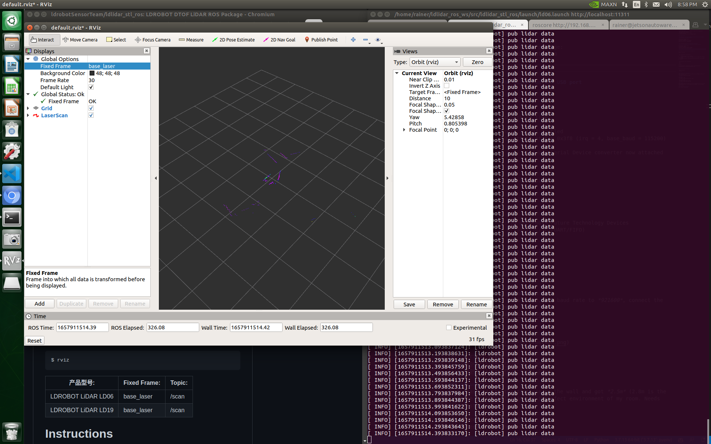
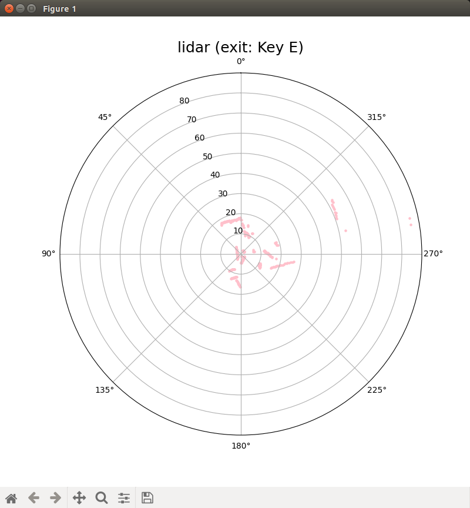

# ldrobot-D300-lidar-test
testing lidar https://www.ldrobot.com/product/en/126

[README](https://github.com/ldrobotSensorTeam/DeveloperKit/blob/master/D300Kit.md)


## 1 sdk
```
rainer@jetsonautoware46:~/projects/ldlidar_stl_sdk/build$ 
./ldlidar_stl /dev/ttyUSB0
```
```
[ldrobot] angle: 332.97 distance(mm): 684 intensity: 235 
[ldrobot] angle: 333.84 distance(mm): 824 intensity: 232 
[ldrobot] angle: 334.71 distance(mm): 839 intensity: 233 
[ldrobot] angle: 335.58 distance(mm): 839 intensity: 235 
[ldrobot] angle: 336.45 distance(mm): 839 intensity: 233 
[ldrobot] angle: 337.32 distance(mm): 855 intensity: 231 
[ldrobot] angle: 338.19 distance(mm): 855 intensity: 232 
```

## 2 ros - rviz
[install ros package](https://github.com/ldrobotSensorTeam/ldlidar_stl_ros)
```
rainer@jetsonautoware46:~/ldlidar_ros_ws$ 
roslaunch ldlidar_stl_ros ld06.launch
```



## 3 python
```
git clone https://github.com/henjin0/LIDAR_LD06_python_loder.git
cd ~/projects/LIDAR_LD06_python_loder
python main.py 
```
note: change port to correct value in *main.py*


